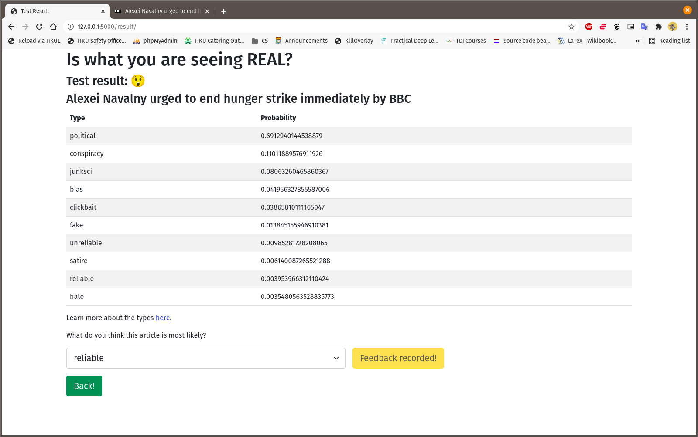

# Functionalities :star:

After running app (Check [how to run](https://github.com/vicw0ng-hk/fake-real-news#running-running_man-running_woman)), go to the link prompted in the terminal, which is usually `localhost:5000`, and you will see...

### :zero:


And then you will find out that `URL`, `Title` an `Authors` are optional fields...

### :one:


You can find a news article and fill in the information (I am going to use [this](https://www.bbc.com/news/world-europe-56854267))...

### :two:


Agree to our [terms and conditions](https://github.com/vicw0ng-hk/fake-real-news#terms-and-conditions-scroll), and you can click on **Check!**...

### :three:


It is indeed a political coverage! But if you disagree, choose another type...

### :four:


And click on **Submit Feedback**...

### :five:



And you will see that it has been recorded, and you can go back now by clicking no **Back!**...

What happens to the recorded data? :confused: If you check `app/app.py`, you will see that it has been recorded in a database called `feedback.sqlite3`. You can use the following code to get recorded feedbacks:

```python
import pandas as pd
import sqlite3

conn = sqlite3.connect('feedback.sqlite3')
df = pd.read_sql_query('SELECT * from Feedback', conn, index_col='id').reset_index(drop=True, inplace=True)
```

### Sustainability :earth_americas:

You can further clean the data as in [Methodology](METHOD.md#data) and then use 

```python
from fastai.text.all import *

dls_clas = DataBlock(blocks=(TextBlock.from_df('content'),CategoryBlock),
                     get_x=ColReader('text'), get_y=ColReader('type'), 
                     splitter=RandomSplitter(0.1)
                    ).dataloaders(df, bs=32, seq_len=80)

learn = load_learner('model.pkl')
learn.dls = dls_clas
```

to load the data into the model and start training as discussed in [Methodology](METHOD.md#classifier-model). After that, simply export the model using `learn.export('model.pkl')` and replace the [`app/model/model.pkl`](app/model/model.pkl) with the newly trained one.
